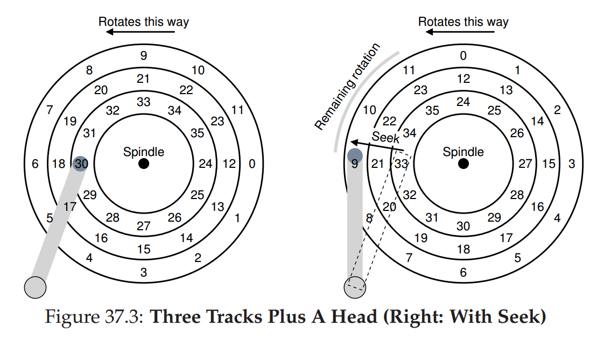
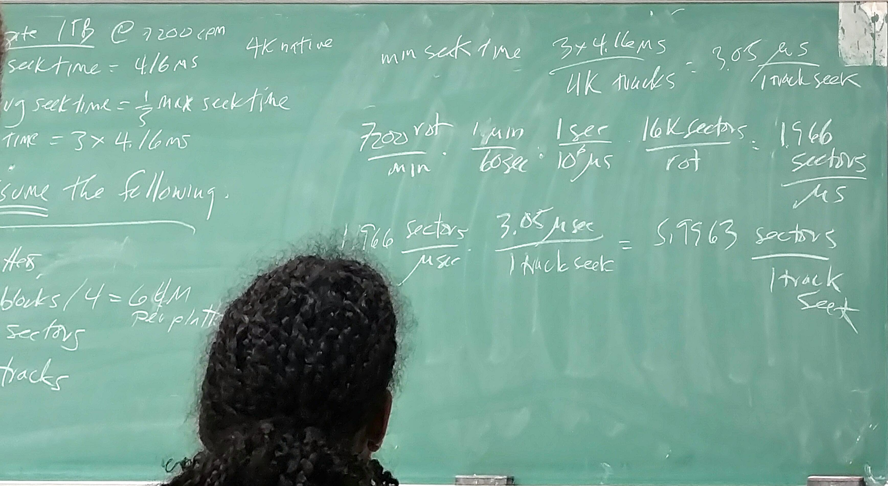
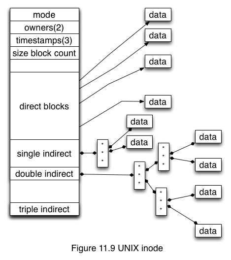

# File System
## (Apr 13)

### File Systems
Purpose: What is a database?

- 0.[Optional] nonvolatile/permanent -> not scratchpad space
- 1. Holds stuff for you
- 2. Finds it for you when you ask

Permanent?

- if non-volatile, it makes sense to optimize it
- if temporary, maybe simpler is better
(critical distinction between FS and VM)

### A few design questions

- Is there a limitation on the # of thing that you can put into these things?
- or just a limit on the total space they occupy?
- or no limits at all
- can they be any size?
	- or one size? one of a few selected sizes?
- do you care where in the bucket your stuff goes? or do you even have a say in the matter?
	- stuff at the top is easier to grab
	- if you do have  a say in where it goes? what does that API look like?
- how do you ask for your stuff?
	- exact unique name?
	- location in the bucket?
	- externally observable characteristics? (meta data) type? ownership?
	- internal contents?
	- based on some set of user-assigned characteristics?
	- something else?

For example, virtual memory

- there's  a limitation on the # of things, VPN has a fixed size
- pages can be of ONE size (old ones) or one of a few selected sizes? (new ones)
- users have no say at all where your data is stored, but OS has little more say because the dram internal origin is opaque.
- users ask for their data using the exact name (VA)
- by defination, it's temporary--no effort at optimization

Unix file system

- file has a name (internally a number)
- it is put into a directory
- it has rwx permissions for owner, group, world
- weakness
	- you've tree hierarchy that serves as a naming scheme ( there's no builtin mechanism to allow you to search, but you can use applications to search..)

BeOS (Berkeley)

- the whole thing is a relational database
	- files
	- meta data
	- all application data
	

Disks

- Architecture / How it looks
	- platters
	- tracks
	- sectors
	- head

	
- The OS needss to know where the head is, what sector/track ... why? 
  placement of data + using the knowledge of disks will get you better performance
	- this is the main difference between original unix FS and Berkeley FFS
	- it pays to order requests that you send to the disk such that they come back quickly

Time

 - two different disk requests arrives the OS at the same time
 - last time the OS accessed the disk 
	 - it was time X
	 - the head was over track y
	 - the lead was over sector z of track y
	 - so where is the head now?

## (Apr 18)

### Some math on disk moves..
e.g. 1TB 7200rpm disk
avg seek time = 416ms
avg seek time 1/3 max seek time, then max seek time = 3x416ms

Let's assume the following 

- 4 platters
- 8k cylenders or tracks
- 8k sectors
- 1 TB 256 M blocks of 4k blocks

> min seek time = max seek time / # of tracks = 3x416us/8k tracks = 1.523 us per track seek
>
> At 7200rpm
>
> 7200 rotation/ min * 1min/60s * 1s/1000000us * 8k sectors/rotation = 0.983 sectors/us
>
> thus,
>
> 0.983 sectors/us x 1.5234 us/1-track-seek = 1.49 sectors/1-track-seek
>
> This means if 
>
> - if you read a block from a track, and next block is in another
> block, by the time you move to that track, 1.5 sectors has passed.

Another math example:

- 1 platter , 256M blocks
- 16 K sectors
- 16 K tracks
- still 1 TB

>min seek time = 3 x 4.16/16k tracks = 0.762 us/track seek
>7200/min* 1min/60s* 1s/1000000us * 16secotrs/rotation = 1.966 sectors/usec
>
>1.966 sectors* 0.762
>
> shoot I gave up... see the photo below:

> but the conclusion here is that if you have fewer platters but more tracks 
> and sectors
> you'll get more "sectors/1-track-seek"

### Options for scheduling 

- Shortest Job First (SJF) principle
- FIFO: obviously not good
- SSTF/SSF: shortest seek first
	- drive geometry not available to OS
	- starvation could happen because rotation is not taken into consideration
- SCAN
	- run the head block and forth read the whole disk, 
	  service requests in track order
	- ignore rotations
- shortest positioning time first (SPTF) 
	- seek + rotational
- However, SSTF + SPTF are both greedy algorithms,
  you probably want SPTF but it requires the geometry info of the disk
	- so SPTF is usually implemented inside of a disk,
	  OS just send a bunch of requests to them and disk will handle it internally

### File Systems Basics

- Superblock -- High level metadata 
	- how big it all is
	- how big a lock is, and how many of them
	- how many inodes
	- bad block list
	- pointer to head of free list (mode free list bit vector)
	
- inode <-> file, 1 to 1 mapping
	- Type + access mode for the file
	- file's ..
	- group ID
	- reference count (links that point to it)
	- time stamps
		- created
		- last read
		- last writeten
		- last mode update
	- size of file (bytes)
	- number of physical blocks used
	- pointers: both direct and indirect
		- ( 12) direct block pointers: only points to 48K
		- (one) indirect pointers: another (#of pointers = block_size/pointer_size) 
		- (one) double indirect pointers: (#of pointers = (block_size/pointer_size)^2)
		- (one) triple indirect 

or simply:

- inode # unique ID for the file, so
	- kinda generic- you can build anything
		- doesn't have to be directory based, could be database
	- how do you get directories?
	- how do you get file names?

2 Things to make managing FS less painful

- Caching
- Concurrency (parallel or pipeling)

## (Apr 20)
### Problem of Traditional FS

- Too damn slow
	- treat disk as RAM, but random access for disk is terrible
	- when files get fragemented, they're spread all over the disk
	- block size too small. (512K), efficient in space but inefficient for performance

### Berkerley Fast File System

- use cylinder groups to make FS "disk aware"
- if cylinder info not available, use block groups instead
- key idea is to make use of sequential access, keep related stuff together (same group)
- so now you'll have locality, and you can cache it!
- problem: fragmentation
	- use smaller (512K) sub groups, but slow

### Caching in FFS

"buffer pool": a collection of 512 blocks (4KB per block)

Block id is hashed to a buffer-hash table which contains a pointer which points to a set of lists, *Locked, LRU, AGE, Free*.

Those 4 lists are ordered lists.

- Locked hold things that should not be thrown away (e.g. copy of super block) (deprecated later because of deadlock problems)
- LRU holds blocks in a time-ordered list
	- when block accessed, more to the head of the list
	- periodically move bottom entries to AGE
- AGE holds things that "need to prove their usefulness"
	- things moved from LRU
	- things speculating prefetched
	- if something isn't used for a while, move to free list
- Free

### Log-structured file systems

Main problems of FS

- bandwidth to disk is okay
- moving the head around sucks
	- writing performance sucks
- are we making best use of cache?

Background/perspective

- Processors getting faster exponentially
	- can do more complex management algorithm
- Memory capacity increasing exponentially
	- bigger caches, reads speed fast
- disk BW- increased rpm, platters, faster signaling... improved exponentially
- disk latency-- NOT improved at all

So

- optimize for writes
- don't reposition the head
- exploit really big caches--reads and write coalesing
- **use a big circular log structure -- write lots of segmential data all at once**

Steps to create a file

- write data block
- write mode for that data block
- rewrite directory data block that points to that data block
- rewrite directory inode
- write inode map

Steps to overwrite a file

- rewrite data block
- rewrite new inode
- (no need to do with directory)
- update inode map
- write nearest inode map

Downside: fragment + garbage collection cuz you need a continuous free chunk of disk that you can write to. 

- So you have to sweep the way ahead of you and free space for you
- some of the data ahead is deleted, some is live
- for live data, need to copy to new location
(write amplification)

LFS chunks the disk into "segments" of 1MB
- if a segment is mostly full, keep it
- otherwise, garbage collect it

Do you use it today? no not on spinning disk, why not?

garbage collection gets in the way
- gets up to 40% of performance degradation 

Worst case: filesystem is x% full, every segment is x% full

- producing one clean segment requires 
	- collect data from N= 1/(1-x) segments
	- write out the data to N-1 of those segments
Say x=50%, then N=2, meaning need to clean 2 segments, coalescence data of 1 of them to the other
if x=75%, then N=4, meaning need to clean 4 segments and write their data to 3 of them, leaving 1 free.

### Intro to flash

- flash doesn't let you overwrite data
- flash does best in large blocks (R/W)
- flash requires garbage collection
- flash needs wear leveling and LFS provides 

data is read/write at page (4KB, 8KNB ... KB) granularity
data is erased at block (64, 128... pages) granularity

## (May, 2)
### Scheduling/Load Balancing Algorithm for Multiprogramming SCAF

**Multiprogramming**: running multiple processes simultaneously
However, current OS schedule threads instead of processes, machines could be oversubscribed

If you run 2 processes at the same time, it takes more than they ran seperately

Gang scheduling sort solve this but breaks the concurrency, not latency sensitive and ineractivity

Space sharing: avoid high speed switching by avoid high-speed switching, but problem is you cannot arbitrarily partition the problem (e.g. like equal-partition) since different program may have different scalability efficiency, an automatic partition algorithm is needed to figure that out.

**make span**: how long it takes to run all the programs

Goals/Metrics:

**make span**
**ipc**: not a good one since it doesn't necessarily represent the scalability and workload of a program.
**IPC ratios**: speedup comparing to single thread results

**SCAF**: improve **parallel efficiency**

**parallel efficiency metric**: "serial experiments", us a child process executes the section serially, use hardware counters to measure speedup by IPC for both the serial section and parallel section.
